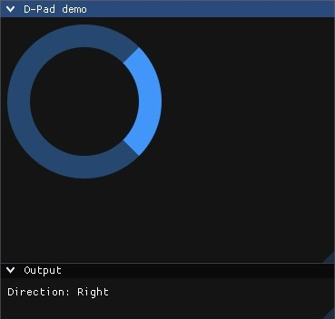
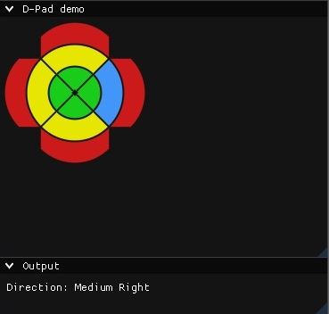

# ImDPad

A simple **Directional Pad (DPad)** widget for [Dear ImGui](https://github.com/ocornut/imgui).

## Features

- 🎮 **Directional Input**: Provides Up, Down, Left, Right button states.
- ⚙️ **Customizable**: adjust size, colors, and spacing to fit your UI style.

## Usage

- Add `dpad.hpp` and `dpad.cpp` to your project.  
- Include `dpad.hpp` in your source file where you want to use the DPad.  
- See the `examples` folder for a working demo.

